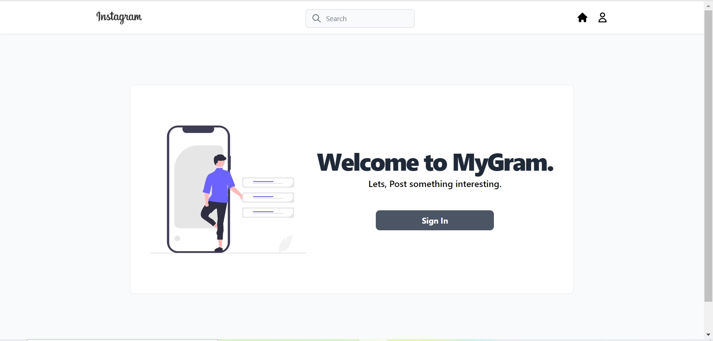
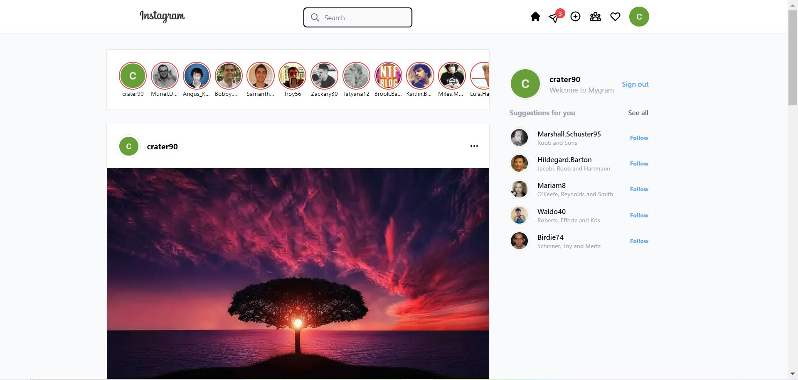
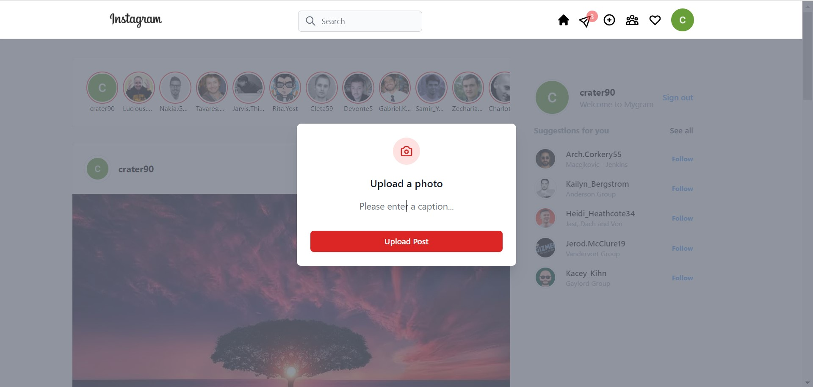

# MyGram Instagram build 2.0

Demo: https://lift-next.vercel.app

MyGram is a social media app designed for social communities. It allows users to create posts, like and comment on it. It is more of a social wall where authenticated users can see the wall.

## Features:

- Sign in with Google to create account and start exploring.
- Allows users to post a photo with a caption.
- Allows users to like and comment the post.

## Tools used:

- Next.js
- Recoil.js
- Firebase Firestore
- Firebase Authentication
- Tailwind
- Headless UI

---

### Running Project Locally:

- Install dependencies: run `npm install` in the root project
- Run project: `npm run dev`
